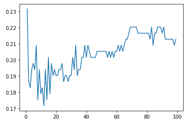
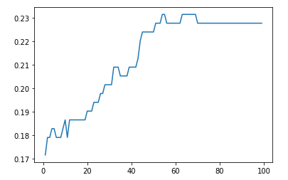
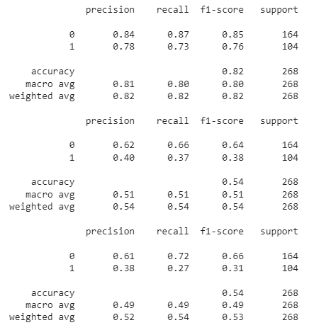

# Сравнение методов классификации (kNN, SVM) и кластеризации (k-means)
> Реализация алгоритма бинарной классификации и кластеризации тестовых данных на примере задачки Titatic на платформе Kaggle. Поскольку у первых двух методов происходит обучение с учителем, то обучающие данные разобьём на обучающую выборку и валидационную.

> Данные представляют собой CSV файл, в котором имеются следующие столбцы:

- **PassengerId** – идентификатор пассажира, по порядку.
- **Survival** – выжил человек (1) или нет (0)
- **Name** – имя пассажира (строковое значение)
- **Pclass** – класс билета (1, 2 или 3)
- **Sex** – пол человека (male или female)
- **Age** – возраст человека (целочисленное значение)
- **Sibsp** – количество братьев и сестер / супругов на борту Титаника (целочисленное значение от 0 до 8)
- **Parch** – количество родителей/детей на борту Титаника (целочисленное значение от 0 до 6)
- **Ticket** – номер билета (строковое значение)
- **Fare** – тариф (значения float64)
- **Cabin** – номер каюты (строковое значение)
- **Embarked** – порт погрузки (C = Cherbourg, Q = Queenstown, S = Southampton)

> В процессе будем задавать различное значение k в методе kNN от которого будут получаться различные решения, что наглядно продемонстрированно на рисунке:

> Также будем задавать различное значение параметра регуляризации C в методе SVM, от которого будут получаться различные решения и соответствующие им величины ошибок, что наглядно продемонстрированно на рисунке ниже:

> Даже при несбалансированности выборки, наилучшим образом проявил себя алгоритм k ближайших соседей, а наихудшим k средних

